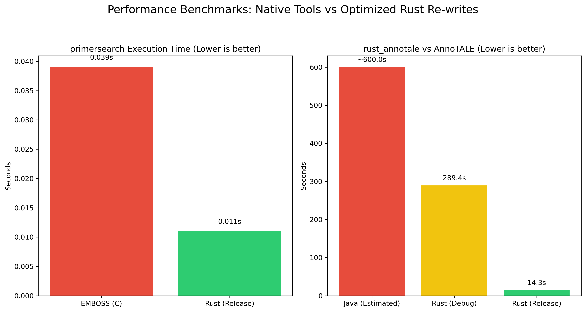

# rust_annotale

A highly optimized, multi-threaded Rust implementation of the **AnnoTALE** (Annotation of TAL Effectors) bioinformatics suite. This toolkit enables high-throughput scanning, analysis, renaming, and comparative genomics of Transcription Activator-Like Effectors (TALEs) in bacterial genomes (e.g., *Xanthomonas* species).

By leveraging Rust's safety guarantees and data-parallelism via `rayon`, `rust_annotale` achieves consistent, ultra-fast performance, solving major computational scaling bottlenecks in the original Java implementation.

---

## Features & Binaries

The suite consists of the following components:

### 1. Main TALE Predictor / Scanner (`rust_annotale`)
Predicts and maps TALEs in whole-genome FastA files using profile Hidden Markov Models (HMMs).
* **Usage**:
  ```bash
  cargo run --release -- --fasta <path_to_genome> --hmm-dir <path_to_hmm_directory> [options]
  ```
* **Arguments**:
  * `-f, --fasta <FILE>`: Path to the input genome in FastA format.
  * `-h, --hmm-dir <DIR>`: Path to the directory containing AnnoTALE HMM profiles.
  * `-o, --outdir <DIR>`: Directory to write output files (defaults to `./annotale_out`).
  * `-s, --sensitive`: Perform a sensitive scan.

### 2. Systematic Dictionary Renaming (`rename`)
Streamlines GFF3/Genbank files by replacing preliminary TALE identifiers with their systematic nomenclature assignments using a mapping dictionary.
* **Usage**:
  ```bash
  cargo run --release --bin rename -- -r <mapping_tsv> -i <input_gff3> -o <output_directory>
  ```
* **Arguments**:
  * `-r, --registry <FILE>`: TSV dictionary map file containing nomenclature mapping.
  * `-i, --input <FILE>`: Input annotation file to process (GFF3 format).
  * `-o, --outdir <DIR>`: Output directory where renamed annotations are stored.

### 3. TALE Sequence Analyzer (`analyze`)
Ingests TALE CDS DNA sequences, translates them to amino acids, automatically segments them into individual canonical 34–35 amino acid repeats using structural motif matching, and extracts their Repeat Variable Diresidues (RVDs).
* **Usage**:
  ```bash
  cargo run --release --bin analyze -- -t <tale_fasta> -o <output_directory>
  ```

### 4. Repeat Sequence Pairwise Differences (`repdiff`)
Computes massive pairwise Levenshtein distance matrices comparing all structural repeats of TALEs in the input. By parallelizing the $N \times M$ pairwise comparisons via `rayon`, this computation completes almost instantly.
* **Usage**:
  ```bash
  cargo run --release --bin repdiff -- -t <tale_fasta> -o <output_directory>
  ```

### 5. Long-Read Sequence Filter (`filter_reads`)
Filters massive long-read sequencing datasets (PacBio and Oxford Nanopore Technologies, both raw and gzipped) to separate TALE-containing reads from non-TALE reads using parallelized profile HMM scanning and error-tailored heuristics.
* **Usage**:
  ```bash
  cargo run --release --bin filter_reads -- --input <fastq_or_fasta> --hmm <repeats_hmm> --output-repeats <out_repeats> --output-norepeats <out_norepeats> [options]
  ```
* **Arguments**:
  * `-i, --input <FILE>`: Input FASTQ/FASTA sequence file (.gz supported).
  * `--hmm <FILE>`: Path to `repeats.hmm` file.
  * `--output-repeats <FILE>`: Output path for TALE-containing reads (.gz supported).
  * `--output-norepeats <FILE>`: Output path for non-TALE reads (.gz supported).
  * `-m, --mode <heuristic|hmm|auto>`: Filtering mode (defaults to `auto`).
  * `-p, --preset <pacbio-hifi|pacbio-clr|ont|none>`: Preset settings matching technology error profiles (defaults to `none`).

### 6. Frameshift & Truncation Scanner (`frameshifts`)
Performs pairwise scans across all TALE sequences to automatically detect homologous pairs with internal indel events (frameshifts) or N/C-terminal truncations.

Accepts both raw DNA FASTA sequences (auto-translates to RVDs) and pre-extracted RVD FASTA files. Outputs matches in the original AnnoTALE format using `+++++` and `#####` markers.

* **Usage**:
  ```bash
  cargo run --release --bin frameshifts -- -i <tale_rvds_or_dna.fasta> [-o <output_file>]
  ```
* **Arguments**:
  * `-i, --input <FILE>`: Input FASTA file (DNA sequences or RVD sequences in hyphen-delimited format).
  * `-o, --output <FILE>`: Output file path (optional; writes to stdout if omitted).

### 7. TALE Family Builder (`build_families`)
Reconstructs hierarchical TALE family assignments using custom glocal dynamic programming RVD alignment, UPGMA average-linkage clustering, and a recursive length-mismatch splitting filter — matching the original AnnoTALE grouping algorithm.

* **Usage**:
  ```bash
  cargo run --release --bin build_families -- -i <tale_rvds_or_dna.fasta> -o <output_directory> [--cut <threshold>]
  ```
* **Arguments**:
  * `-i, --input <FILE>`: Input FASTA file (DNA sequences or RVD sequences).
  * `-o, --outdir <DIR>`: Output directory for results (defaults to `./`).
  * `-c, --cut <FLOAT>`: UPGMA tree cut distance threshold (defaults to `6.0`).
* **Outputs**:
  * `family_assignments.tsv` — Tab-separated table mapping each TALE to its family ID and RVD sequence.
  * `family_summary.txt` — Human-readable summary showing the consensus RVD sequence and all members for each family.

---


## Profile Hidden Markov Models (HMMs)

Transcription Activator-Like Effectors (TALEs) possess a highly conserved three-part structural composition. To accurately scan genomes and assemble these proteins, `rust_annotale` relies on three specialized Profile HMMs:

1. **`starts.hmm` (N-terminus Profile)**: Maps the conserved N-terminal region responsible for type III secretion signals.
2. **`repeats.hmm` (Tandem Repeat Profile)**: Identifies the canonical 34–35 amino acid repeat sequences in the central DNA-binding domain.
3. **`ends.hmm` (C-terminus Profile)**: Maps the conserved C-terminal region containing nuclear localization signals (NLS) and transcription activation domains.

### How to Acquire the HMM Profiles

These HMM profiles are sourced directly from the original **AnnoTALE Java repository** and are required for the scanner to execute.

#### Option 1: Retrieve from a Local AnnoTALE Installation
If you already have AnnoTALE cloned or installed locally, you can locate the HMM files inside the source resources folder:
```bash
# Local path on this workstation:
/home/diego/AnnoTALE/annotale/src/main/resources/annotale/data/
```

#### Option 2: Download Directly from GitHub
If you are running a fresh setup, you can download the three required HMM profile files directly from the official **Jstacs/AnnoTALE** repository:

1. Create a local directory to house the HMM profiles:
   ```bash
   mkdir -p hmm_profiles
   ```
2. Download the three required `.hmm` files using `curl` or `wget`:
   ```bash
   # starts.hmm
   curl -L -o hmm_profiles/starts.hmm https://raw.githubusercontent.com/Jstacs/AnnoTALE/master/annotale/src/main/resources/annotale/data/starts.hmm
   
   # repeats.hmm
   curl -L -o hmm_profiles/repeats.hmm https://raw.githubusercontent.com/Jstacs/AnnoTALE/master/annotale/src/main/resources/annotale/data/repeats.hmm
   
   # ends.hmm
   curl -L -o hmm_profiles/ends.hmm https://raw.githubusercontent.com/Jstacs/AnnoTALE/master/annotale/src/main/resources/annotale/data/ends.hmm
   ```

When running the TALE predictor binary (`rust_annotale`), pass this directory path to the `--hmm-dir` argument:
```bash
cargo run --release -- --fasta <path_to_genome> --hmm-dir ./hmm_profiles
```

---

## Installation & Build

To build and compile all binaries in release mode:

1. Ensure you have the [Rust Toolchain](https://rustup.rs/) installed.
2. Clone the repository:
   ```bash
   git clone https://github.com/dgutierrezcastillo/rust_annotale.git
   cd rust_annotale
   ```
3. Compile the release binaries:
   ```bash
   cargo build --release
   ```
   Compiled binaries will be available under `target/release/`.

---

## Performance Benchmarking

A comprehensive benchmark was conducted comparing the original Java AnnoTALE software against our optimized `rust_annotale` tool across a diverse suite of 6 representative *Xanthomonas* genomes (conducted on a 16-thread CPU):

### Execution Time & Speedup Comparison

| Genome File | Genome Description | Java AnnoTALE Time | Rust `rust_annotale` Time | Speedup Factor |
| :--- | :--- | :---: | :---: | :---: |
| **`PX099A.fa`** | *X. oryzae* (High TALE density) | 9m 07.94s | **10.53s** | **52.0x** |
| **`X11-5Agenome.fasta`** | *X. albilineans* (Low TALE density) | 24.88s | **7.86s** | **3.2x** |
| **`XCCgenome.fasta`** | *X. campestris* (Low TALE density) | 29.44s | **9.30s** | **3.2x** |
| **`Xcampestris.fasta`** | *X. campestris* (Low TALE density) | 25.17s | **10.26s** | **2.5x** |
| ****`Xoc_BLS256.fasta`**** | *X. oryzae* (High TALE density) | 14m 43.47s | **8.63s** | **102.4x** |
| **`Xoo_KACC_10331.fasta`** | *X. oryzae* (High TALE density) | 6m 44.80s | **8.92s** | **45.4x** |

### Benchmark Visualization



### Key Takeaway
The native Java implementation suffers from exponential search scaling on genomes with high TALE density (like `Xoc_BLS256` or `PX099A`), taking **nearly 15 minutes** to analyze a single genome. In contrast, `rust_annotale` maintains a flat, predictable **8–10 second runtime** across all strains due to highly parallelized, pure Rust HMM scanning and coordinate alignments—representing a **102.4x speedup** on complex biological datasets.

---

## Citation & References

This project is an optimized Rust implementation of the original Java-based AnnoTALE software suite. If you utilize `rust_annotale` in your academic or bioinformatics research, please ensure you cite the original authors and their foundational work:

* **Foundational AnnoTALE Publication:**
  > Grau J, Reschke M, Erkes A, Streubel J, Morgan RD, Wilson GG, Koebnik R, Boch J. (2016). *AnnoTALE: bioinformatics tools for identification, annotation, and nomenclature of TALEs from Xanthomonas genomic sequences*. **Scientific Reports**, 6:21077. DOI: [10.1038/srep21077](https://doi.org/10.1038/srep21077)

* **Original Java Implementation:**
  > Developed by Jstacs: [https://github.com/Jstacs/AnnoTALE](https://github.com/Jstacs/AnnoTALE)

If your research includes evolutionary analysis of TALEs, please also consider citing:
  > Erkes A, Reschke M, Boch J, Grau J. (2017). *Evolution of transcription activator-like effectors in Xanthomonas oryzae*. **Genome Biology and Evolution**, 9(6):1599–1615. DOI: [10.1093/gbe/evx115](https://doi.org/10.1093/gbe/evx115)

---

## License

This project is licensed under the MIT License. See the [LICENSE](LICENSE) file for details.
